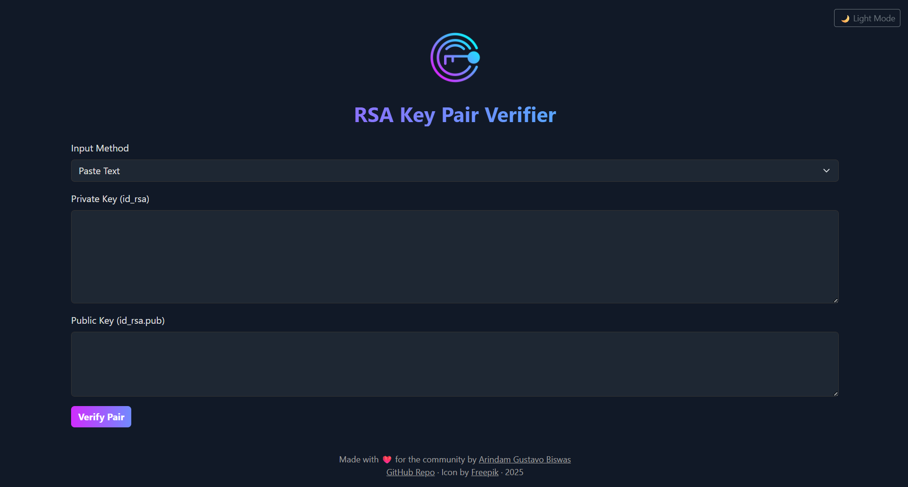

# 🔐 RSA Key Pair Verifier


### A simple web application to verify if an RSA private and public key pair matches.



## ✨ Features

- 🔒 Verifies RSA private/public key pair validity
- 🧠 Supports text or file uploads as input
- 🌗 Dark/light theme with animations
- ⚡ Single-page experience with no reloads
- 📦 Docker-ready production deployment using Gunicorn

## 🚀 Check Live Preview
### [Live Demo](https://rsakeypairverifier.arindamgb.com/)

## 🐳 Run from Docker Hub

You can run the app directly from Docker Hub:

```bash
docker run -itd --name rsa-key-pair-verifier -p 5000:5000 arindamgb/rsa-key-pair-verifier:latest
```
The app will run at:
```
http://localhost:5000
```

## 🐋 Build and Run with Docker

```bash
git clone https://github.com/arindamgb/rsa-key-pair-verifier.git
cd rsa-key-pair-verifier
bash run.sh
```
> 27th June 2025, 11:00 PM

#### Made with ❤️ for the community by [Arindam Gustavo Biswas](https://www.linkedin.com/in/arindamgb/)
